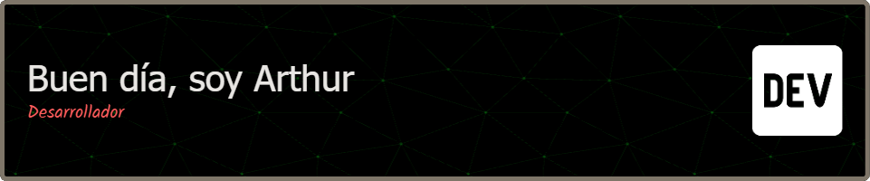

## 🧑‍💻 Sobre mí

- 🎓 Estudiante de IT en UADE
- 📚 Certificado en Google Cloud y Google AI (Vertex)
- 💻 Asesor educativo en programación 
- 🧠 Amante del competitivo del LoL
- ☕ Fanatico de la frase "Nunca pares de aprender"  

---

## 🛠️ Tecnologías y herramientas

---

## 📊 Estadísticas de GitHub

<table>
  <tr>
    <td>
      
    </td>
    <td>
      
    </td>
  </tr>
</table>

---

## 🌱 Actualmente

- Dando clases particulares en programación y desarrollo web  
- Participando en la creacion de un MVP
- Creando proyectos con Java + Swing, React y SQL  
- Explorando nuevas formas de aprender y enseñar tecnología  

---

## 📫 Conectá conmigo

---

## 🧠 Frase que me resuena 

> *"Nunca pares de Aprender"* - Freddy Vega

---

*¡Gracias por visitar mi perfil! Si llegaste hasta acá, ¡quizás deberíamos codear juntos! 🚀*
